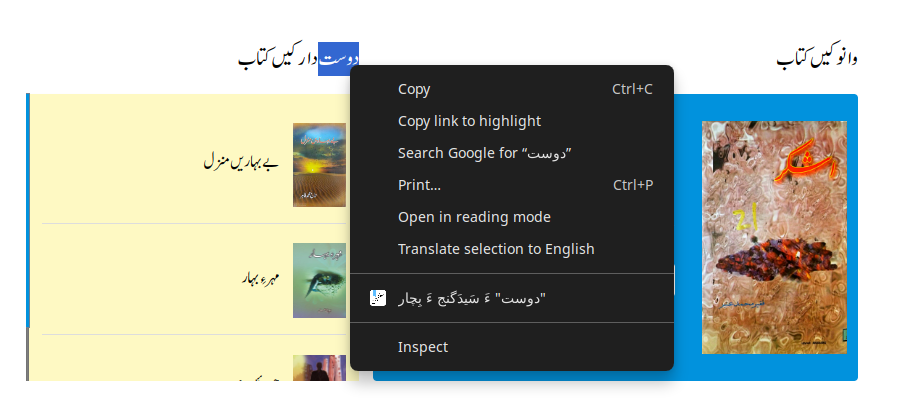
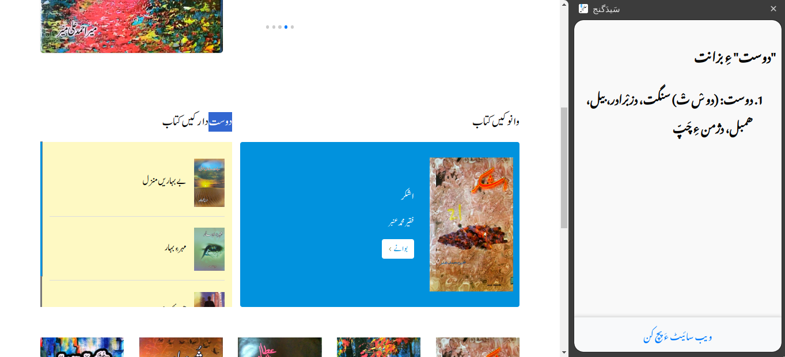

# Sayadganj Dictionary Chrome Extension

Sayadganj Dictionary is a simple Chrome extension that allows you to look up definitions of selected words on any webpage using the Sayadganj dictionary. The extension provides definitions in the Balochi language and displays them in a sidebar. It also allows quick access to the Sayadganj website for further search.

## Features
- Right-click on any selected word to search its definition using Sayadganj.
- Definitions are shown in a side panel in a Nastaleeq font (RTL).
- Dynamic link to search the selected word directly on the Sayadganj website.

## Screenshots

### Context Menu

### Sidebar

